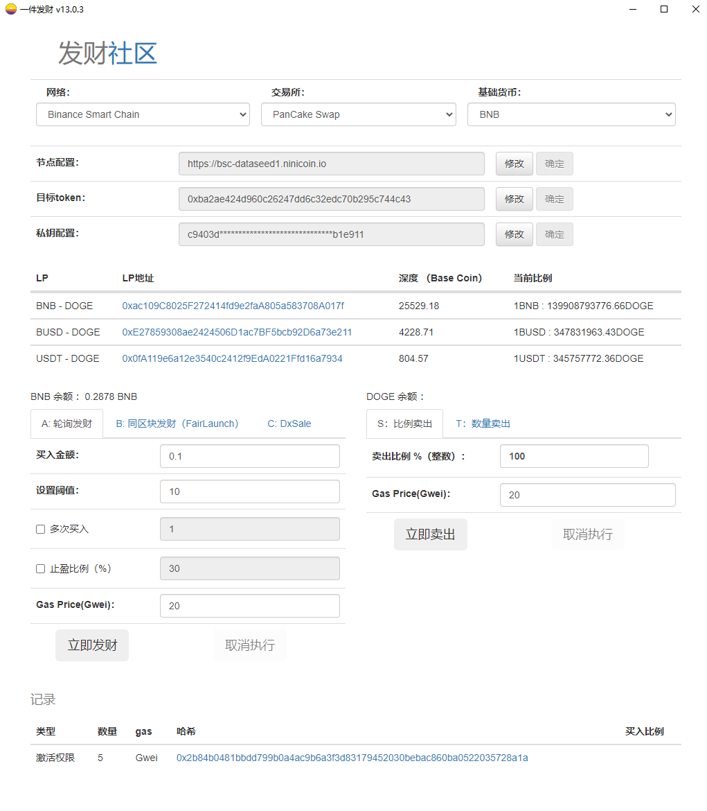
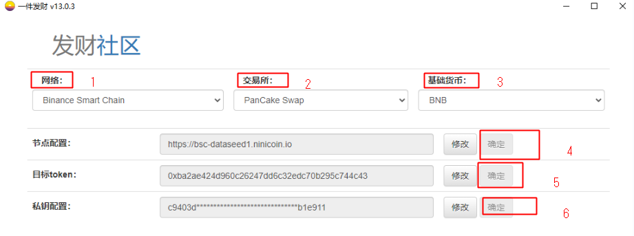
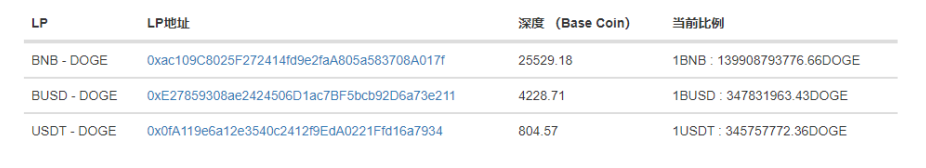
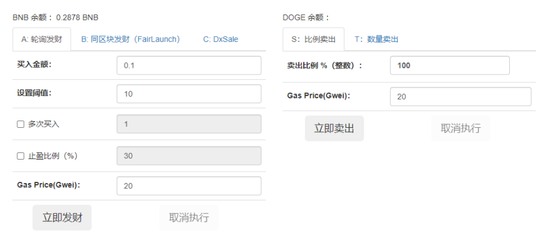
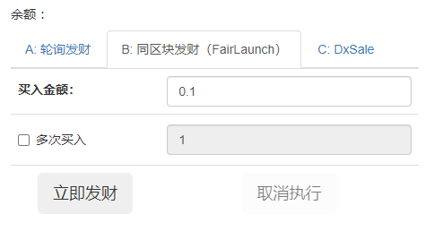
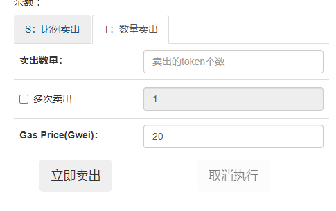
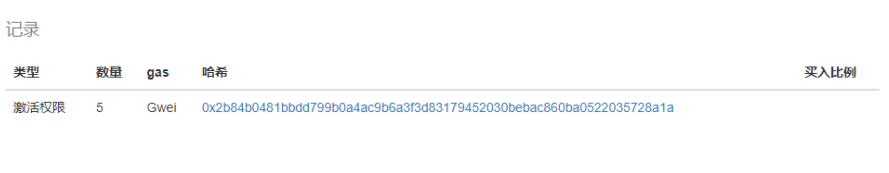

# 使用说明 【请耐心看完】

## 依赖

> 软件依赖 **Chrome** 浏览器， 运行前请确认本地环境已经安装

## 声明

> **本软件不对任何损失产生兜底， 包括私钥丢失。 使用前请确认风险。** 

## -1 广告

> 接**针对某项目**机制的 **定制化脚本**， 视复杂程度 200U 起。 

### 0 主界面预览：

### 1 参数填写

> 按编号顺序填写，不可跳过 

> 私钥配置完成后，会检测 **基础货币** 与 **目标token** 是否 Approve ， 如果没有就会发起Approve。

### LP选择

> 重要： 参数填好后会监控所有的LP地址，**本软件不提供动态的路径规划**， 请自行选择深度比较好的池子（更改基础货币）

> 例如： USDT/DOGE 深度为100U    BUSD/DOGE 深度为1000000万U , 显然 BUSD的深度较好，将基础货币切换成BUSD即可。

## 2 买入

### 2.1 轮询模式

> ​	 不燃烧手续费

#####  参数释义：

| 名称     | 说明                                    | 备注                                                |
| -------- | --------------------------------------- | --------------------------------------------------- |
| 买入金额 | 基础货币的买入金额                      |                                                     |
| 阈值     | 深度单位， 当LP的深度大于阈值后进行买入 |                                                     |
| 多次买入 | 买入次数                                |                                                     |
| 止盈比例 | 大于止盈比例后自动卖出                  | 30% 为 买入金额的130%卖出，100%为买入金额的200%卖出 |
| GasPrice | 单位 Gwei                               | 根据网络情况自行设置， 建议 20-100                  |

### 2.2 同区块买入

> 原理：监听 **入池** 事件，在矿工确认之前同步买入  不燃烧手续费

> 注意： 同区块买入只支持 **Fairlaunch** 模式

### 2.3 DxSale 预售

> 监听开始时间，开始后执行买入

## 3 卖出

#### 3.1 比例卖出

> **卖出数量 =  余额 * 比例**   （比例需为整数）

#### 3.2 数量卖出

> ​	按输入数量卖出 

### 4 操作记录

